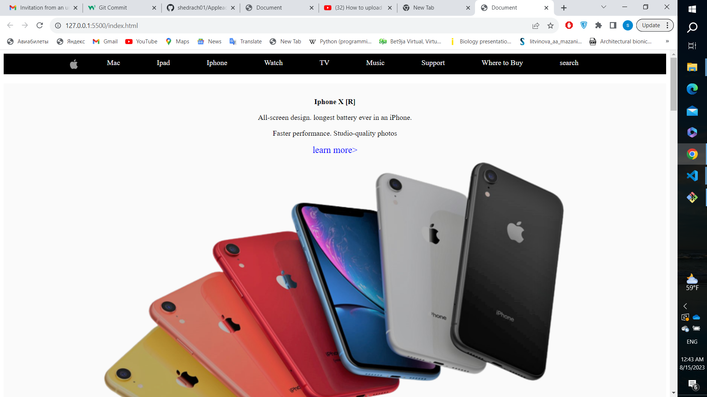

# Link_Projet

This project show how to build a page with a link and to design the page



## Background

- CSS
- HTML

# Usage 

> Clone  the repository to your local machine

```sh
$ git clone https://github.com/shedrach01/Appleads

```
> cd into directory 

```sh
$ cd Link_Project
```

## Maintainers

 **Shedrach Iroanya**

- Githun: [@shedrach01](https://github.com/shedrach01)


## Future Features
1. add additional details.

## License

Shedrach iroanya
